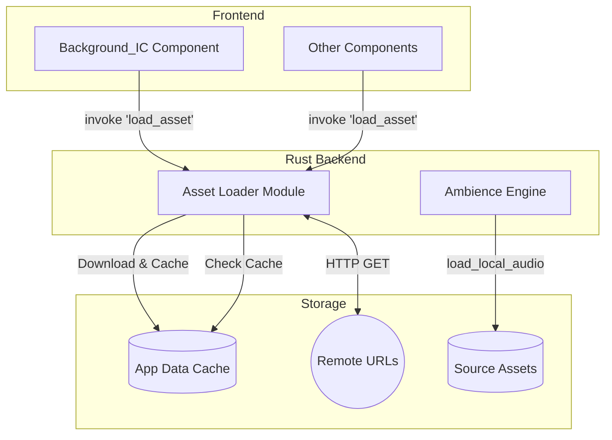

# HyphaeicOS Asset Loader

This document details the centralized asset loading system used by HyphaeicOS for both remote and local assets.

## 1. Architecture Overview

The Asset Loader provides a unified interface for loading assets from multiple sources:
1. **Remote Assets**: Downloaded from URLs and cached to app data directory
2. **Local Assets**: Read from the source tree (for bundled audio, etc.)



## 2. Component Breakdown

### 2.1 Remote Asset Loader (`asset_loader.rs`)

Handles downloading, caching, and retrieval of remote assets.

**Supported Asset Types:**
```rust
pub enum AssetType {
    Image,    // → images/*.jpg
    Video,    // → videos/*.mp4
    Audio,    // → audio/*.mp3
    Document, // → documents/*.pdf
    Other(String),
}
```

**Cache Structure:**
```
$APPDATA/com.eonk.hyphaeicos/
└── assets/
    ├── images/
    │   └── {hash}.jpg
    ├── videos/
    │   └── {hash}.mp4
    ├── audio/
    │   └── {hash}.mp3
    └── documents/
        └── {hash}.pdf
```

**Key Features:**
- **URL-to-filename hashing**: Uses `DefaultHasher` to generate unique cache filenames
- **Async I/O**: Uses `tokio` for non-blocking file operations
- **HTTP client**: Uses `reqwest` for downloading
- **Cache validation**: Checks file existence before downloading

### 2.2 Local Audio Loader

Loads bundled audio assets from the source tree during development.

```rust
pub fn load_local_audio(filename: &str) -> std::io::Result<Vec<u8>> {
    let base_path = "../src/assets/audio/ambient";
    let path = std::path::Path::new(base_path).join(filename);
    std::fs::read(path)
}
```

**Used by:**
- `AmbienceEngine` for loading ambient tracks (`home.mp3`, `terminal.mp3`, etc.)
- `SfxEngine` for loading sound effects

## 3. Integration with Frontend

### 3.1 Background Component (`background_IC.tsx`)

The Background component demonstrates the complete integration pattern:

```typescript
import { invoke } from "@tauri-apps/api/core";
import { convertFileSrc } from "@tauri-apps/api/core";

// 1. Call Rust to load/cache the asset
const assetInfo = await invoke<AssetInfo>("load_asset", {
    url: "https://src.hyphaeic.com/1.jpg",
    assetType: "Image",
});

// 2. Convert local path to webview-accessible URL
const assetUrl = convertFileSrc(assetInfo.path);

// 3. Use in  or other elements

```

**AssetInfo Response:**
```typescript
interface AssetInfo {
    path: string;      // Absolute path to cached file
    cached: boolean;   // true if loaded from cache, false if freshly downloaded
    asset_type: string; // "Image", "Video", etc.
}
```

### 3.2 convertFileSrc

The `convertFileSrc` function from `@tauri-apps/api/core` converts a local filesystem path to a URL that the webview can display:

- **Input**: `C:\Users\...\assets\images\abc123.jpg`
- **Output**: `asset://localhost/C:/Users/.../assets/images/abc123.jpg`

This is required because webviews cannot directly access `file://` URLs for security reasons.

## 4. Integration with Audio System

### 4.1 Ambience Engine Integration

The `AmbienceEngine` uses `load_local_audio` to load ambient tracks at startup:

```rust
// In AmbienceEngine::initialize_sinks()
let assets = [
    (AmbientTrack::Home, "home.mp3"),
    (AmbientTrack::WindowHeader, "windowHeader.mp3"),
    (AmbientTrack::Terminal, "terminal.mp3"),
];

for (track_id, filename) in assets.iter() {
    match load_local_audio(filename) {
        Ok(data) => {
            // Decode MP3 → PCM → SamplesBuffer → Sink
            let cursor = Cursor::new(data);
            let decoder = Decoder::new(cursor)?;
            let samples: Vec<f32> = decoder.convert_samples().collect();
            // ... create Sink and start silent playback
        }
        Err(e) => eprintln!("[Audio] Asset load failed: {}", e),
    }
}
```

### 4.2 Asset Location

During development, local audio assets are loaded from:
```
src/assets/audio/
├── ambient/
│   ├── home.mp3
│   ├── windowHeader.mp3
│   └── terminal.mp3
└── sfx/
    ├── cursorMove.wav
    └── cursorClick.wav
```

## 5. Tauri Commands

### `load_asset`
Downloads and caches a remote asset.

```typescript
const asset = await invoke<AssetInfo>('load_asset', {
    url: 'https://example.com/image.jpg',
    assetType: 'Image' // or 'Video', 'Audio', 'Document'
});
```

### `is_asset_cached`
Checks if an asset is already cached.

```typescript
const cached = await invoke<boolean>('is_asset_cached', {
    url: 'https://example.com/image.jpg',
    assetType: 'Image'
});
```

### `get_asset_cache_path`
Gets the expected cache path without downloading.

```typescript
const path = await invoke<string>('get_asset_cache_path', {
    url: 'https://example.com/image.jpg',
    assetType: 'Image'
});
```

### `clear_asset_cache`
Clears cached assets.

```typescript
// Clear all
await invoke('clear_asset_cache', {});

// Clear specific type
await invoke('clear_asset_cache', { assetType: 'Image' });
```

## 6. Data Flow Diagrams

### Remote Asset Loading

```
┌─────────────────┐     ┌─────────────────┐     ┌─────────────────┐
│  Frontend       │     │   Rust Backend  │     │   Filesystem    │
│  Component      │     │   Asset Loader  │     │                 │
└────────┬────────┘     └────────┬────────┘     └────────┬────────┘
         │                       │                       │
         │ invoke('load_asset')  │                       │
         │──────────────────────>│                       │
         │                       │                       │
         │                       │  Check cache exists?  │
         │                       │──────────────────────>│
         │                       │<──────────────────────│
         │                       │                       │
         │     [IF NOT CACHED]   │                       │
         │                       │                       │
         │                       │  ┌─────────────────┐  │
         │                       │  │  HTTP GET URL   │  │
         │                       │  └────────┬────────┘  │
         │                       │           │           │
         │                       │  Write to cache path  │
         │                       │──────────────────────>│
         │                       │                       │
         │  AssetInfo { path, cached, type }             │
         │<──────────────────────│                       │
         │                       │                       │
         │ convertFileSrc(path)  │                       │
         │ ↓                     │                       │
         │ asset://localhost/... │                       │
         │                       │                       │
```

### Local Audio Loading

```
┌─────────────────┐     ┌─────────────────┐     ┌─────────────────┐
│  AmbienceEngine │     │   Asset Loader  │     │ Source Assets   │
│  (Audio Module) │     │                 │     │                 │
└────────┬────────┘     └────────┬────────┘     └────────┬────────┘
         │                       │                       │
         │ load_local_audio("home.mp3")                  │
         │──────────────────────>│                       │
         │                       │                       │
         │                       │ std::fs::read()       │
         │                       │──────────────────────>│
         │                       │                       │
         │                       │<── Vec<u8> ───────────│
         │                       │                       │
         │<── Ok(bytes) ─────────│                       │
         │                       │                       │
         │ Decode → PCM → Sink   │                       │
         │                       │                       │
```

## 7. Performance Considerations

- **Cache-first**: Always checks cache before downloading
- **Async downloads**: Non-blocking HTTP requests via `reqwest`
- **Hash-based filenames**: O(1) cache lookup, collision-resistant
- **Memory for audio**: Local audio files are fully buffered in memory after decoding (~30MB per 3-min track)

## 8. Future Enhancements

- [ ] Production bundling for local audio (embed in binary)
- [ ] Cache expiration / LRU eviction
- [ ] Download progress events
- [ ] Retry logic for failed downloads
- [ ] Streaming audio support for large files
- [ ] Pre-caching / prefetch API
