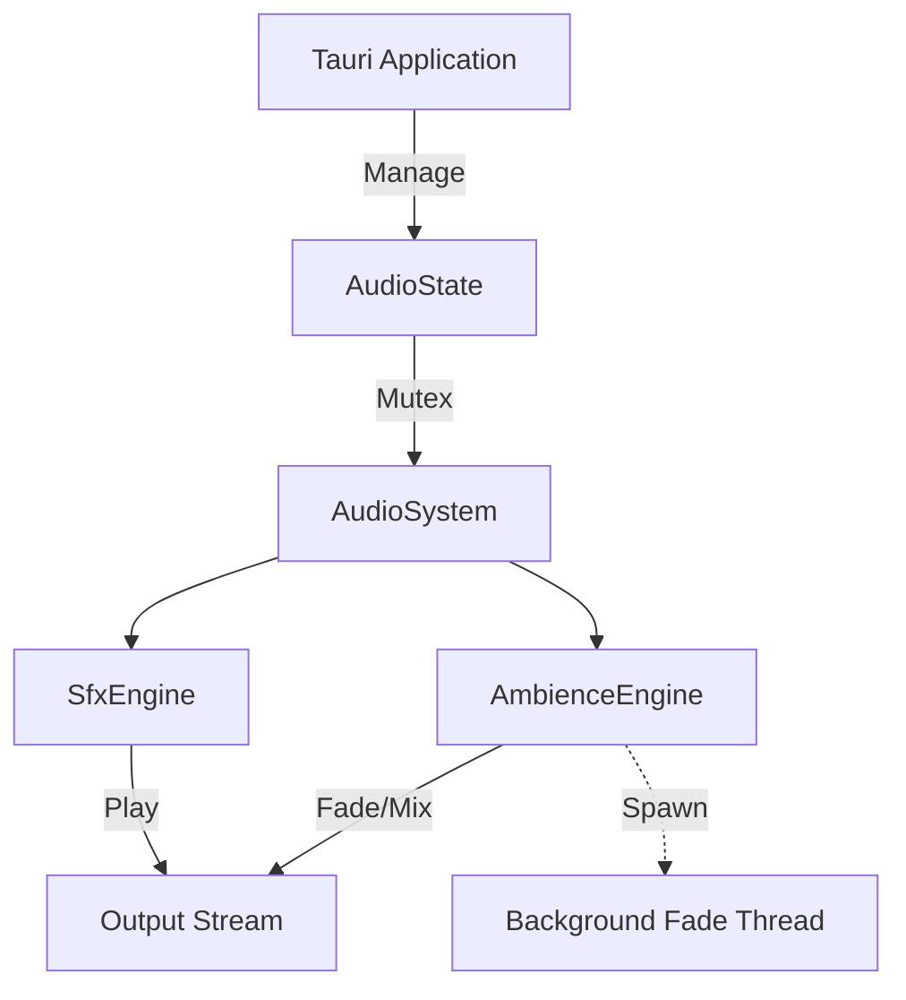

# HyphaeicOS Audio System Architecture

This document details the implementation of the low-latency, cross-fading audio system used in HyphaeicOS.

## 1. Architecture Overview

The audio system is designed for two distinct use cases:
1.  **SFX (Sound Effects)**: Instant feedback for UI interactions (navigation, clicking). Requirements: Zero latency, fire-and-forget.
2.  **Ambience**: Immersive background audio that changes based on the user's "Domain" (context). Requirements: Seamless looping, smooth cross-fading between tracks, high stability.

The system is built on top of `rodio` and uses a centralized `AudioSystem` struct managed by Tauri's state container.



## 2. Component Breakdown

### 2.1 Asset Loader (`asset_loader.rs`)
All audio files are loaded via a centralized loader. 
- **Dev Mode**: Reads directly from `../src/assets/audio/`.
- **Production**: (Planned) Will read from the resource bundle or app data.

### 2.2 SFX Engine (`sfx.rs`)
- **Strategy**: "Decode-on-Load".
- **Implementation**:
    - All SFX files (WAV/MP3) are decoded into raw PCM data (`Vec<u8>` or `Vec<f32>`) at startup.
    - These raw buffers are stored in a `HashMap`.
    - **Triggering**: When `play_sfx("id")` is called, a `Cursor` is created over the read-only memory buffer. This is extremely fast (nanoseconds) as no I/O or heavy decoding happens at trigger time.
- **Key Methods**:
    - `preload_assets()`: Loads `cursorMove.wav`, `cursorClick.wav`, etc.
    - `play(id)`: Spawns a new source from the buffer and sends it to the mixer.

### 2.3 Ambience Engine ("Virtual Timeline") (`ambience.rs`)
This is the core of the immersive experience. It implements a **Virtual Timeline** where all tracks are technically "active" but mixed dynamically.

- **Problem**: Seeking in MP3s for looping is prone to clicks and errors.
- **Solution (PCM Buffering)**:
    - On load, ambient MP3s are fully decoded into `Vec<f32>` (32-bit float PCM).
    - These samples are stored in a `DecodedTrack` struct in memory.
    - **Looping**: We use `rodio::buffer::SamplesBuffer` which wraps the raw `Vec<f32>`. The `.repeat_infinite()` method creates an iterator that loops over this memory slice perfectly, with zero gaps.

- **Crossfading (The Fade Thread)**:
    - Instead of managing volume on the main thread (which risks stutter if UI blocks), we spawn a dedicated `std::thread`.
    - **Ownership**: The Fade Thread *owns* the active `Sink`s.
    - **Communication**: The main thread uses a `mpsc::Sender` to send the `TargetTrack` enum to the thread.
    - **Logic**:
        - Runs at ~100Hz (10ms sleep).
        - Uses **Delta Time** (`Instant::now()`) to calculate volume changes, ensuring smooth fades regardless of scheduling jitter.
        - **Algorithm**:
            ```rust
            if track == target {
                volume += (1.0 / fade_duration) * dt; // Ramp UP
            } else {
                volume -= (1.0 / fade_duration) * dt; // Ramp DOWN
            }
            ```

## 3. Integration Guide

### 3.1 Initializing
The system is initialized in `lib.rs`:
```rust
// In lib.rs setup()
let audio_state = app.state::<AudioState>();
if let Ok(mut sys) = audio_state.0.lock() {
    // Triggers the initial ambient track
    sys.on_domain_change("osbar-nav");
}
```

### 3.2 Triggering Sounds (Backend)
Any Tauri command or internal logic can trigger sounds via `AudioState`:

```rust
// Access state
let state: State<AudioState> = ...;
let mut sys = state.0.lock().unwrap();

// Play SFX
sys.play_sfx("nav"); 

// Switch Ambience (usually handled via domain system)
sys.on_domain_change("new-domain-id");
```

### 3.3 Adding New Assets

#### Adding SFX
1.  Place the file in `src/assets/audio/sfx/`.
2.  Open `src-tauri/src/audio/sfx.rs`.
3.  Add the key to the `preload_assets` map:
    ```rust
    let assets = [
        ("my_new_sound", "my_new_sound.wav"),
        // ...
    ];
    ```
4.  Call it: `sys.play_sfx("my_new_sound")`.

#### Adding Ambience
1.  Place the file in `src/assets/audio/ambient/`.
2.  Open `src-tauri/src/audio/ambience.rs`.
3.  Add a variant to `enum AmbientTrack`.
4.  Add the file mapping in `initialize_sinks`:
    ```rust
    let assets = [
        (AmbientTrack::MyZone, "my_zone_theme.mp3"),
        // ...
    ];
    ```
5.  Map the domain ID to the track in `update_context`:
    ```rust
    let target_track = if domain_id.contains("my-zone") {
        AmbientTrack::MyZone
    } ...
    ```

## 4. Performance Considerations
- **Memory**: Ambient tracks are uncompressed in RAM. A 3-minute stereo track at 44.1kHz 32-bit float is ~30MB. This is acceptable for modern desktops but be mindful of adding too many full-length tracks.
- **CPU**: The fade thread consumes negligible CPU (mostly sleeping). Mixing is handled by `rodio`/OS audio thread.


