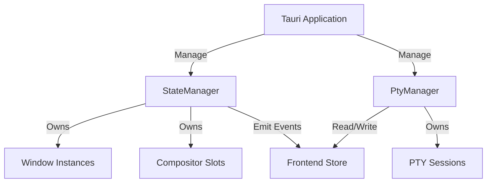
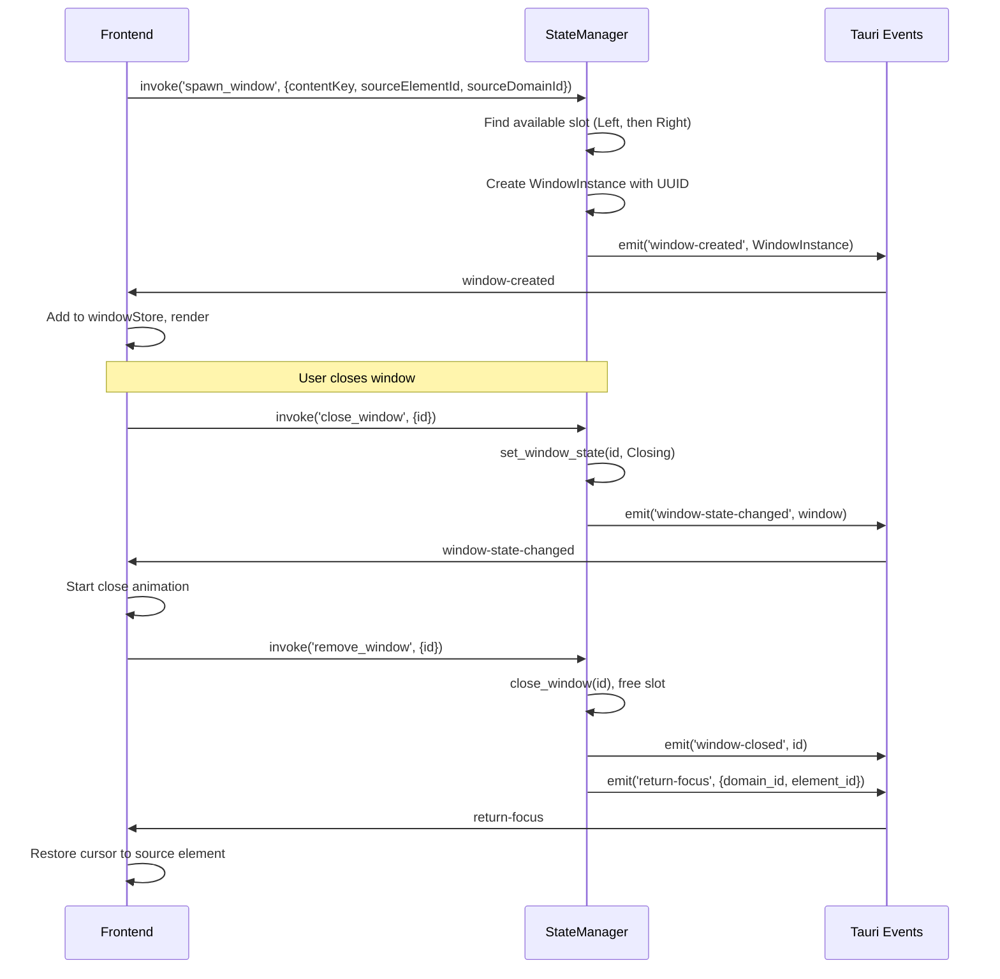
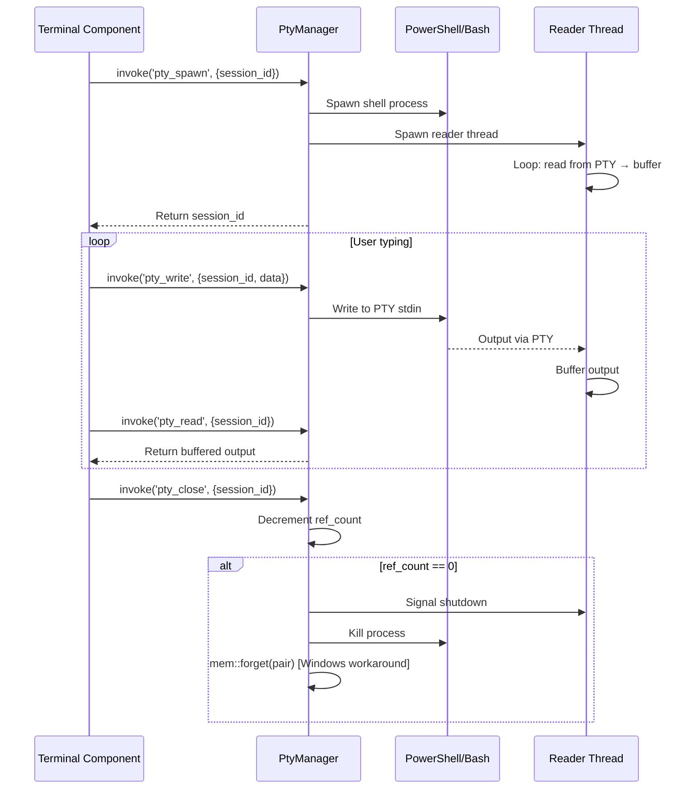

# HyphaeicOS State Management System

This document details the state management architecture used in HyphaeicOS, covering window management, compositor slots, and PTY terminal sessions.

## 1. Architecture Overview

The state management system is designed around a **Rust-first** philosophy where Rust owns all application state. The frontend receives state updates via Tauri events and renders accordingly.



## 2. Component Breakdown

### 2.1 StateManager (`mod.rs`)

The core state container that manages windows and the dual-slot compositor system.

**Key Fields:**
```rust
pub struct StateManager {
    pub windows: HashMap<String, WindowInstance>,  // All active windows
    pub window_stack: Vec<String>,                 // Focus history (z-order)
    pub left_slot: Option<String>,                 // Window ID in left slot
    pub right_slot: Option<String>,                // Window ID in right slot
}
```

**Key Methods:**
- `spawn_window(content_key, source_element_id, source_domain_id)` → Spawns window in first available slot
- `close_window(id)` → Frees slot and returns closed window (for focus return)
- `set_window_state(id, state)` → Transitions window between states
- `get_window_in_slot(slot)` → Query window by compositor slot
- `normalize_stack()` → Updates z-order after changes

### 2.2 WindowInstance (`window.rs`)

The window data structure passed between Rust and frontend.

```rust
pub struct WindowInstance {
    pub id: String,                       // UUID
    pub content_key: String,              // What to render (e.g., "SYS_TERMINAL")
    pub title: String,                    // Window title
    pub state: WindowState,               // Current state
    pub slot: CompositorSlot,             // Assigned slot
    pub z_order: u32,                     // Stacking order
    pub source_element_id: Option<String>, // Button that spawned this window
    pub source_domain_id: Option<String>,  // Domain that spawned this window
}
```

### 2.3 WindowState

Enum representing the window's visual state:

| State | Description |
|-------|-------------|
| `Minimized` | Half-size, occupies one compositor slot |
| `Maximized` | Full-size, spans both slots |
| `Hidden` | Not rendered |
| `Closing` | Playing close animation (transitions to removal) |

### 2.4 CompositorSlot

```rust
pub enum CompositorSlot {
    Left,   // First slot (assigned first)
    Right,  // Second slot
}
```

### 2.5 PtyManager (`pty/mod.rs`)

Manages PTY (pseudo-terminal) sessions for terminal emulation.

**Key Features:**
- **Reference counting**: Multiple terminal windows can share a session
- **Thread-safe output buffer**: Background thread reads from PTY, main thread polls buffer
- **Platform-specific shells**: PowerShell on Windows, bash on Unix
- **Graceful cleanup**: Handles Windows ConPTY quirks via `mem::forget`

**Session Structure:**
```rust
pub struct PtySession {
    pub pair: PtyPair,                           // PTY master/slave pair
    pub child: Box<dyn Child + Send + Sync>,     // Shell process
    pub writer: Arc<Mutex<Box<dyn Write + Send>>>, // Write to PTY
    pub output_buffer: Arc<Mutex<Vec<u8>>>,      // Read buffer
    pub is_alive: Arc<Mutex<bool>>,              // Session alive flag
    pub ref_count: u32,                          // Reference count
}
```

## 3. Window Lifecycle



## 4. PTY Terminal Lifecycle



## 5. Integration Guide

### 5.1 Window Commands

```typescript
import { invoke } from "@tauri-apps/api/core";

// Spawn a window
const window = await invoke<WindowInstance>('spawn_window', {
    contentKey: 'SYS_TERMINAL',
    sourceElementId: 'btn-terminal',
    sourceDomainId: 'osbar-nav'
});

// Change window state
await invoke('set_window_state', {
    id: window.id,
    windowState: 'Maximized' // or 'Minimized', 'Hidden', 'Closing'
});

// Close window (triggers animation)
await invoke('close_window', { id: window.id });

// Remove window after animation
await invoke('remove_window', { id: window.id });
```

### 5.2 PTY Commands

```typescript
// Spawn PTY session (use window ID as session ID)
await invoke('pty_spawn', { sessionId: window.id });

// Get system banner
const banner = await invoke<string>('get_system_banner', { sessionId: window.id });

// Write to terminal
await invoke('pty_write', { sessionId: window.id, data: 'ls -la\r' });

// Poll for output (typically in a setInterval)
const output = await invoke<string>('pty_read', { sessionId: window.id });

// Resize terminal
await invoke('pty_resize', { sessionId: window.id, rows: 24, cols: 80 });

// Close session
await invoke('pty_close', { sessionId: window.id });
```

### 5.3 Listening to Window Events

```typescript
import { listen } from "@tauri-apps/api/event";

// Window spawned
await listen('window-created', (event) => {
    const window = event.payload as WindowInstance;
    addWindow(window);
});

// Window state changed
await listen('window-state-changed', (event) => {
    const window = event.payload as WindowInstance;
    updateWindow(window);
});

// Window closed
await listen('window-closed', (event) => {
    const windowId = event.payload as string;
    removeWindow(windowId);
});

// Return focus after window close
await listen('return-focus', (event) => {
    const { domain_id, element_id } = event.payload;
    // Restore navigation cursor to the element that spawned the window
});
```

## 6. Frontend Store (`store.ts`)

The frontend maintains a reactive store that mirrors the Rust state:

```typescript
export const [windowStore, setWindowStore] = createStore<WindowStoreState>({
    windows: [],
});

// Helpers
export function addWindow(window: WindowInstance);
export function removeWindow(id: string);
export function updateWindow(updatedWindow: WindowInstance);
export function getWindowInSlot(slot: CompositorSlot);
```

## 7. Dual-Slot Compositor

The compositor supports exactly two windows side-by-side:

```
┌─────────────────────────────────────────────────┐
│                   Compositor                     │
│  ┌──────────────────┐  ┌──────────────────┐     │
│  │   Left Slot      │  │   Right Slot     │     │
│  │   (50% width)    │  │   (50% width)    │     │
│  │                  │  │                  │     │
│  │   WindowInstance │  │  WindowInstance  │     │
│  │   state: Mini-   │  │  state: Mini-    │     │
│  │   mized          │  │  mized           │     │
│  └──────────────────┘  └──────────────────┘     │
└─────────────────────────────────────────────────┘
```

**Maximized Window:**
```
┌─────────────────────────────────────────────────┐
│                   Compositor                     │
│  ┌────────────────────────────────────────┐     │
│  │          Single Window (Maximized)      │     │
│  │          100% width                     │     │
│  │                                         │     │
│  │          Other window is Hidden         │     │
│  └────────────────────────────────────────┘     │
└─────────────────────────────────────────────────┘
```

## 8. Performance Considerations

- **Window spawning**: O(1) - HashMap insert and slot assignment
- **PTY polling**: Runs at ~100Hz via `setInterval` on frontend, buffer drain is O(n)
- **Memory**: Each PTY session maintains a growing output buffer; consider implementing buffer limits for long-running sessions
- **Windows ConPTY**: Uses `mem::forget` to avoid cleanup crash - minor memory leak per closed terminal

## 9. Future Enhancements

- [ ] More than two compositor slots
- [ ] Window snapping and resizing
- [ ] Tab support within windows
- [ ] PTY output buffer limits
- [ ] Session persistence across restarts
